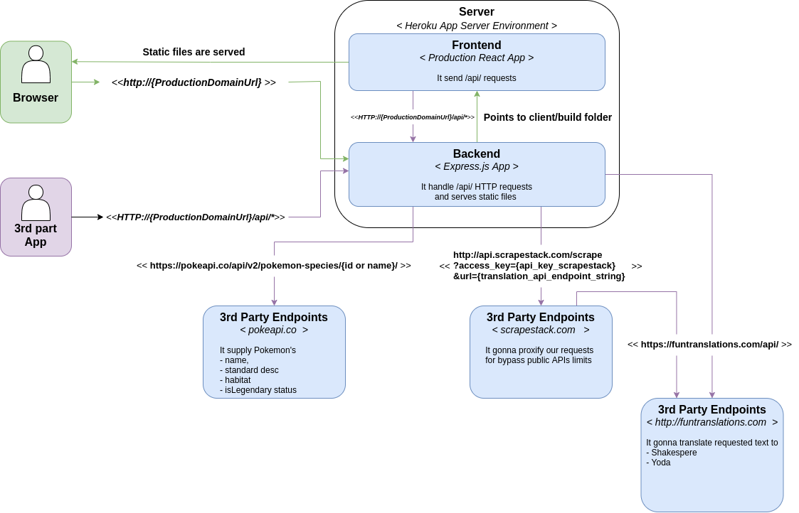

# TrueLayer Pokedex API

Software challenge doc: [Link](https://docs.google.com/document/d/13ToU_Njl6aarwqJdTV9x8xkXv2XSNEWF_USpN8b1knM/edit)

Software Architecture at Systems Scope
  ( [C4 model](https://c4model.com/) standard)
  

### Technologies of choice:

- Heroku
- Docker
- Express.js
- Mocha

### Boilerplate

- [heroku-docker-nodejs](https://elements.heroku.com/buttons/orangemug/heroku-docker-nodejs)

 
 